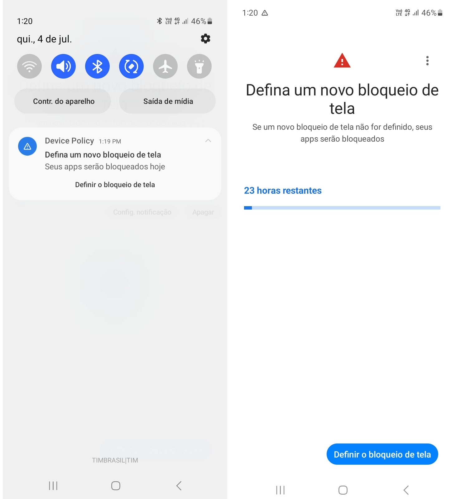

---
layout:
  title:
    visible: true
  description:
    visible: false
  tableOfContents:
    visible: true
  outline:
    visible: true
  pagination:
    visible: true
---

# Restrições de Senha

Estando na guia de "**Configurações**" da tela de "**Edição de Políticas**", clique sobre "**Restrições de Senha**" para visualizar as opções de configuração de senha. Na tabela a seguir, as configurações de senha são descritas.

<table data-header-hidden><thead><tr><th width="284.80616740088107"></th><th></th></tr></thead><tbody><tr><td><strong>Configuração</strong></td><td><strong>Descrição</strong></td></tr><tr><td>Qualidade da senha</td><td>

Quando a qualidade da senha é "Alguma" significa que uma senha é necessária, mas não há restrições sobre o que a senha deve conter.

As outras possibilidades de configuração de senha são:
<ul><li>Não Especificado - não há exigência de senha.</li><li>biometria - O dispositivo deve ser protegido com uma tecnologia de reconhecimento biométrico de baixa segurança, no mínimo.</li><li>alguma - o dispositivo deve ter algum tipo de senha ou método de autenticação, sem especificar qual.</li><li>numérica - a senha deve conter caracteres numéricos;</li><li>numérica complexa - a senha deve conter caracteres numéricos sem sequências repetidas (4444) ou ordenadas (1234, 4321, 2468).</li><li>alfabética - a senha deve conter caracteres alfabéticos (ou símbolos).</li><li>alfanumérica - a senha deve conter caracteres numéricos e alfabéticos (ou símbolos).</li><li>complexa - a senha deve conter ao menos uma letra, um caractere numérico e um símbolo.</li></ul>
<em>Para mais informações acesse a seção</em> <a href="restricoes-de-senha.md#exigencia-de-senha-e-conformidade-com-a-politica">Exigência de Senha e Conformidade com a Política</a> <em>mais abaixo nesta página.</em>
</td></tr><tr><td>Comprimento de histórico de senhas</td><td>Define o número de senhas já usadas que não podem ser reutilizadas</td></tr><tr><td>Máximo de senhas incorretas antes de executar wipe</td><td>Define o máximo de tentativas incorretas antes de executar o Wipe</td></tr><tr><td>Tempo limite de expiração da senha (dias)</td><td>Define quantos dias a senha vai levar para expirar</td></tr><tr><td>Exigir desbloqueio de senha</td><td>Nesta configuração temos as opções: Padrão do dispositivo, ou seja, definida conforme configurado no dispositivo ou todo dia, neste caso a senha será solicitada todo dia</td></tr><tr><td>Comprimento mínimo da senha</td><td>Essa configuração define o tamanho mínimo exigido para as senhas criadas, fortalecendo a segurança dos dados e só é exibida ao selecionar os tipos de Qualidade de senha: numérica ,numérica complexa, alfabética , alfanumérica e complexa</td></tr><tr><td>Número mínimo de letras exigidas na senha</td><td>Esta configuração é exibida apenas quando é selecionado o tipo de Qualidade de Senha Complexa e define a quantidade mínima de letras necessárias para as senhas, com um número específico de caracteres alfabéticos nas combinações de senha</td></tr><tr><td>Número mínimo de letras minúsculas exigidas na senha</td><td>Essa configuração é exibida apenas quando é selecionado o tipo de Qualidade de Senha Complexa e determina o mínimo de letras minúsculas necessárias em senhas</td></tr><tr><td>Número mínimo de caracteres que não sejam letras (dígitos numéricos ou símbolos) necessários na senha</td><td>Esta configuração é exibida apenas quando é selecionado o tipo de Qualidade de Senha Complexa e define o mínimo de caracteres não alfabéticos necessários nas senhas</td></tr><tr><td>Número mínimo de dígitos numéricos necessários na senha</td><td>Esta configuração é exibida apenas quando é selecionado o tipo de Qualidade de Senha Complexa e define o número mínimo de dígitos numéricos necessários nas senhas</td></tr><tr><td>Número mínimo de símbolos necessários na senha</td><td>Essa configuração é exibida apenas quando é selecionado o tipo de Qualidade de Senha Complexa e estabelece a quantidade mínima de símbolos exigidos nas senhas, nas combinações de senha</td></tr><tr><td>Número mínimo de letras maiúsculas exigidas na senha</td><td>Esta configuração é exibida apenas quando é selecionado o tipo de Qualidade de Senha Complexa e define a quantidade mínima de letras maiúsculas obrigatórias na senha</td></tr></tbody></table>

### Exigência de Senha e Conformidade com a Política

Quando uma política de segurança de senha é aplicada a um dispositivo, ele deve estar em conformidade com essa política. Se a senha atual do dispositivo não atender às exigências definidas pela política, o seguinte processo ocorrerá:

* Se a senha do dispositivo não estiver em conformidade com a política (por exemplo, se for muito fraca ou não atender aos critérios mínimos de segurança estabelecidos), o dispositivo exibirá uma mensagem de alerta.
* Este alerta serve para notificar o usuário de que a senha precisa ser alterada para uma que esteja em conformidade com a política de segurança.
* O usuário tem um prazo de 24 horas para fazer essa alteração.

<figure><figcaption></figcaption></figure>

* Se após 24 horas a senha ainda não tiver sido alterada para atender às exigências da política, o dispositivo será bloqueado e formatado em 48 horas.
* Essa medida é uma exigência do Google para garantir que os dispositivos mantenham um nível mínimo de segurança. A senha do dispositivo deve ser, no mínimo, igual ou mais segura do que a definida pela política.
