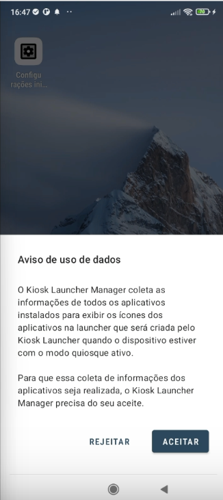

---
layout:
  title:
    visible: true
  description:
    visible: false
  tableOfContents:
    visible: true
  outline:
    visible: true
  pagination:
    visible: true
---

# Modo Quiosque

Esta configuração tem como objetivo possibilitar a criação de um ambiente em que o usuário do dispositivo possa acessar somente os aplicativos previamente liberados pelo administrador, ou seja, apenas os ícones dos aplicativos selecionados serão exibidos na tela do dispositivo.

Para acessar as configurações de "**Modo Quiosque**" siga os seguintes passos:

1. Na tela "**Editar política**", selecione a guia "**Modo Quiosque**".
2. Ative o modo quiosque clicando sobre o botão de ativação.

<figure><figcaption></figcaption></figure>

3. Será exibida na tela uma mensagem para confirmação. Confirme clicando no botão "**Ativar**".

<figure><figcaption></figcaption></figure>

4. Ao ativar o Modo Quiosque na política e provisionar um dispositivo com esta política, o aplicativo **Kiosk Launcher Manager** será instalado automaticamente no dispositivo.

Quando o dispositivo instalar o aplicativo Kiosk, o aplicativo capturará a lista de todos os aplicativos instalados no dispositivo enviará esta lista para o Portal. Além disto enviará as configurações gerenciadas para o portal.  E alterará a launcher do Dispositivo para a launcher do aplicativo Kiosk, não permitirá que o usuário altere a launcher no dispositivo e manterá a configuração de Modo Quiosque recebida na politica.

Os aplicativos que serão exibidos no dispositivo, serão definidos na política, ou seja, somente os aplicativos liberados na política serão exibidos na laucher.


**NOTA**\
Ao ativar o Modo Quiosque, para o correto funcionamento do aparelho ou de alguma aplicação, se faz necessário, a inclusão de forma manual dos seguintes pacotes de Sistema:&#x20;

\- Acessibilidade Samsung: **com.samsung.accessibility**

\- Lupa de pesquisa: **com.android.settings.intelligence**

\- Pop-up "Abrir com" do navegador: **com.android.intentresolver / android**

\- Pop-up "Abrir com" do sistema: **com.android.systemic / android**

\- Instalações OTA (Over-the-air) para dispositivos Samsung: **com.wssyncmldm**

\- Transferência de arquivos quando conectado no PC: **com.android.systemui / com.samsung.android.MtpApplication**

Para saber mais sobre como incluir aplicativos de forma manual na política , leia a sessão: [Aplicativos](aplicativos/).


### Opções de configuração do Quiosque

Estando o modo quiosque ativado, as seguintes opções de configuração estarão disponíveis:&#x20;

<figure><figcaption></figcaption></figure>

* **Botões de navegação**: permite definir os botões de navegação do dispositivo como "Ativo", "Bloqueado" ou "Apenas botão Home";
* **Botão "Power"**:  permite definir o botão power do dispositivo como "Disponível" ou "Bloqueado";
* **Exibir Mensagens de Erro**: permite definir a exibição de mensagens de erro como "Ativo" ou "Silenciado";
* **Informações Exibidas na Barra de Status**: permite definir as informações que serão exibidas na barra de status do dispositivo.  Pode ser definido como "Notificações e informações do sistema", "Apenas informações do sistema" ou "Nenhuma";
* **Acesso à Configurações**: permite definir como "Liberado" ou "Bloqueado";


**OBSERVAÇÃO**&#x20;

Durante a ativação de um dispositivo em uma política com Modo Quiosque Ativo, a configuração "**Acesso à Configurações**" precisa estar como "**Liberada**", para que o usuário possa conceder as permissões solicitadas para a ativação do Aplicativo de Gestão. Isto poque o usuário precisa acessar diretamente a interface de configurações do dispositivo. Por esse motivo, no modo quiosque nenhum aplicativo conseguirá ativar permissões que exijam acesso a interface de configuração do SO, se as configurações estiverem bloqueadas na política. Após o enroll as configurações poderão ser bloqueadas se necessário.&#x20;

Outra opção, para não precisar deixar o acesso as configurações liberado, é deixar as permissões do Aplicativo de Gestão como opcional, assim o usuário consegue ativar sem que seja necessário conceder as permissões, porém neste caso, os dados referentes as permissões não concedidas, não serão coletados.


* **Serviços Adicionais de Telefonia**: permite definir os serviços de telefonia como "Ativo" ou "Definido pelo dispositivo".  Ao definir como "Ativo" e salvar a política, o sistema enviará na política e no quiosque os pacotes dos serviços de telefonia para o dispositivo, e permitirá receber e realizar ligações no dispositivo que provisionar a política. E ao definir como "Definido pelo Dispositivo", o dispositivo funcionará de acordo com a sua configuração padrão, tendo ou não os serviços.

<figure><figcaption></figcaption></figure>

* **Papel de parede** - pode ser realizado o upload de uma imagem de papel de parede na política e definido a orientação de tela, que serão enviados para o aplicativo

<figure><figcaption></figcaption></figure>

* **Cor da fonte dos ícones -** permite configurar a cor do texto dos ícones na tela inicial

<figure><figcaption></figcaption></figure>

* **Orientação de Tela -** permite selecionar a orientação de tela para o dispositivo, e o padrão é: “Definido pelo usuário"

<figure><figcaption></figcaption></figure>

* **Tamanho de ícones e Fontes -** permite selecionar as seguintes opções de tamanho de exibição: Padrão do sistema _(padrão),_ Pequeno (_75%_) e Grande (_125%_).

<figure><figcaption></figcaption></figure>

* **Ordenação dos ícones -** permite realizar a ordenação dos ícones

<figure><figcaption></figcaption></figure>

* **Posicionamento da imagem -** permite selecionar a posição da imagem do papel de parede na tela inicial do dispositivo

<figure><figcaption></figcaption></figure>

* **Bloquear acesso as configurações de Wi-Fi -** impede que os usuários acessem e modifiquem as configurações de Wi-Fi durante a inicialização e uso do dispositivo no modo Kiosk.

<figure><figcaption></figcaption></figure>

* **Acesso Temporário ao Dispositivo -** Configuração para permitir que o usuário realize acesso ao dispositivo durante um determinado tempo. Para ativar a permissão, arraste a chave para a direita de quem esta a frente da tela. Além disto, é possível definir o tempo de duração do acesso do usuário no dispositivo. Que pode ser de 5, 10, 15, 30 minutos ou 1 hora. Ao habilitar o acesso temporário, será gerada uma senha para que o usuário possa acessar o dispositivo, na sessão ["](../../dispositivos/lista-de-dispositivos/opcoes-de-gerenciamento-de-dispositivos.md)[Opções de Gerenciamento de Dispositivos" ](../../dispositivos/lista-de-dispositivos/opcoes-de-gerenciamento-de-dispositivos.md)detalharemos melhor como irá funcionar.

Abaixo Listamos quais acessos o usuário terá no dispositivo ao informar a senha de acesso temporário:

* Liberará acesso a todos os os aplicativos instalados que estiverem na política, mesmo que não estejam visíveis no Modo Quiosque (Google Play e Remotos);
* Liberará acesso a todos os os aplicativos de sistema que existem na política (_independente se esta visível_);
* Liberará acesso a todas as configurações do dispositivo, mas para isto, é necessário que o aplicativo de sistema "**Configurações**" esteja incluso na política e que a permissão **Acesso à Configurações** esteja como **Liberado** no Modo Quiosque.

<figure><figcaption></figcaption></figure>

<figure><figcaption></figcaption></figure>

Após encerrar o tempo definido, o usuário perde os acessos mencionados acima novamente e o dispositivo retorna ao Modo Quiosque:

<figure><figcaption></figcaption></figure>

### **Permissão para Exibição dos Aplicativos na** Tela Inicial

Ao iniciar o **Kiosk Launcher** pela primeira vez, será exibida uma tela solicitando o consentimento do usuário para a coleta de informações dos aplicativos instalados. Essa coleta é necessária para que a launcher exiba corretamente os ícones dos aplicativos quando o dispositivo estiver no **modo quiosque**.

**Exibição da Mensagem**

Assim que o **Kiosk Launcher** for aberto, será apresentada a seguinte mensagem:

<figure><figcaption></figcaption></figure>

O usuário poderá escolher entre duas opções:

* **Rejeitar**
  * A mensagem será fechada.
  * As informações dos aplicativos instalados não serão coletadas.
  * A launcher exibirá apenas o Kiosk Launcher, sem os ícones dos demais aplicativos.
* **Aceitar**
  * A mensagem será fechada.
  * As informações dos aplicativos instalados serão coletadas.
  * A launcher exibirá os aplicativos instalados corretamente.


Se a opção **"Rejeitar"** for selecionada, a tela inicial não conseguirá exibir os ícones dos aplicativos, exceto o **Kiosk Launcher**. Caso o usuário mude de ideia, será necessário permitir a coleta de informações nas configurações do dispositivo ou reinstalar o aplicativo para visualizar a solicitação novamente.


### Modo Quiosque ChromeOS

O Modo Quiosque no ChromeOS foi desenvolvido para configurar dispositivos Chromebook em um ambiente controlado, ideal para cenários como aplicação de provas, garantindo que os alunos usem o dispositivo apenas para atividades autorizadas.

1. Selecione o menu "Informações da Empresa".
2. Na seção "Google Workspace", insira o ID do Cliente no Workspace.
3. Acesse a tela de Gestão de Políticas e clique em "Criar nova política".
4. Clique na aba ChromeOS, e selecione o modo de gerenciamento ChromeOS e cadastre a política.

Alguns dos pré-requisitos para ativar o ChromeOS são:

* Registro do Google Workspace;
* Criação das unidades organizacionais;
* Configuração dos bloqueios;
* Registro dos dispositivos no Workspace do cliente;

Para acessar as configurações da política siga os seguintes passos:

1. Na tela "**Editar política**", na guia "**Modo Quiosque**".
2. Clique na seta "˅", para acessar as opções de configurações disponíveis.

<figure><figcaption></figcaption></figure>

3. Preencha o formulário para ativação de eventos:
   * **Unidades Organizacionais:** selecione as unidades que possuem os dispositivos.
   * **Unidade Organizacional de Destino:** selecione onde o Modo Quiosque será aplicado.

<figure><figcaption></figcaption></figure>


**Observação**

* As unidades devem ser preenchidas previamente dentro Google Workspace.
* Não é permitido selecionar a mesma unidade como origem e destino.
* Alterações podem levar até 24 horas para entrar em vigor, conforme a Google.
* Algumas opções, como Copiar Política e Token de Registro, estarão desabilitadas para políticas ChromeOS.


4. Após preencher as unidades, clicar em Salvar.
5. O sistema habilitará os botões para “Iniciar" e “Concluir" o evento. \
   \- Iniciar: quando clicar em “Iniciar" as unidades de dispositivos serão movimentadas para dentro do unidade de destino.\
   \- Concluir: quando clicar em "Concluir" as unidades de dispositivos retornarão para dentro da unidade que estava antes da movimentação.
