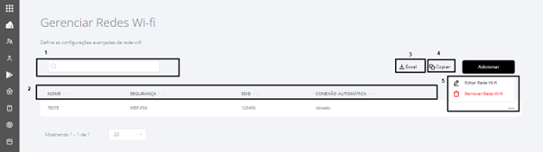

# Gerenciar Redes Wi-Fi

Para acessar a tela Gerenciar Redes Wi-fi, devemos acessar o menu “**Configurações**” e o Submenu “**Gerenciar Redes Wi-fi**” conforme segue:

<figure><figcaption></figcaption></figure>

Ao acessar o submenu a tela abaixo será exibida, clique em "**Adicionar**":

<figure><figcaption></figcaption></figure>

Após clicar em "Adicionar", a seguinte tela para preenchimento dos dados da Rede Wi-fi, será exibida. Todos os campos devem ser preenchidos, ao finalizar clique em "Salvar".

<figure><figcaption></figcaption></figure>

* **Nome da Configuração**: identificação personalizada para a rede Wi-Fi configurada.
* **SSID**: nome da rede Wi-Fi que será exibido aos usuários.
* **Rede oculta -** indica se a rede Wi-Fi é oculta e não será exibida automaticamente nas listas de redes disponíveis.
* **Senha**: código de acesso necessário para conectar-se à rede Wi-Fi.
* **Conectar automaticamente -** define se o dispositivo deve se conectar automaticamente a esta rede quando estiver ao alcance.
* **Modo do Endereço MAC**: define como o endereço MAC do dispositivo será utilizado (automático ou MAC do dispositivo).
* **Tipo de Segurança**: método de criptografia usado para proteger a rede Wi-Fi (Nenhum, WEP-PSK, WPA-PSK, WPA/EAP, WEB-8021X ou WPA3-Enterprise\_192).

Ao selecionar o tipo de segurança “WPA-EAP" ou “WEP-8021X" ou "WPA3-Enterprise\_192, serão exibidos mais campos para preenchimento: Nome do Domínio, Identidade, Identidade Oculta, Senha do Usuário, Autenticação Inner, Autenticação Outer, Tipo de Certificado do Cliente, Certificado do Cliente, Tipo de Certificado do Servidor e Certificado do Servidor.


**NOTA**

Nos campos  Certificado do Cliente e  Certificado do Servidor, caso não desejar subir arquivo, basta manter a opção "Selecione uma opção", selecionada, assim o sistema não habilitará os campos de carregamento do arquivo.


<figure><figcaption></figcaption></figure>

Após Salvar, o portal retornará à tela anterior, onde será exibida a rede salva e caso existam outras redes , serão listadas também.

<figure><figcaption></figcaption></figure>

1. Utilize o campo de busca para pesquisar um rede cadastrada;
2. Utilize as setas nos campos Nome, Segurança, SSID, ou Conexão Automática, para ordenar as informações;
3. Para exportar os dados, utilize o botão Excel;
4. Para copiar os dados, utilize o botão Copiar;
5. Ao clicar nos três (...) pontinhos, serão exibidas as opções de Editar Rede Wi-fi e Remover Rede Wi-fi.
