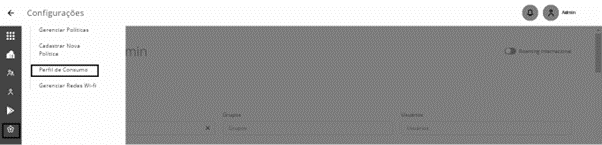

# Perfil de Consumo

Para acessar a tela Perfil de Consumo, devemos acessar o menu “**Configurações**” e o Submenu “**Perfil de Consumo**” conforme segue:

<figure><figcaption></figcaption></figure>

A figura a seguir mostra a tela de configuração de perfil de consumo que é acessada no menu "**Configurações**". Um retângulo destaca o acesso às guias “**Geral**", "**Grupos**" e "**Usuários**".

<figure><figcaption></figcaption></figure>

Os limites podem ser configurados para:

* **Dados –** Define o consumo máximo de dados móveis;
* **SMS –** Define consumo máximo de mensagens SMS;
* **SMS Roaming –** Define consumo máximo de mensagens SMS quando o dispositivo está em roaming;
* **Dados Roaming –** Define o consumo máximo de dados móveis quando o dispositivo está em roaming;

1. Selecione uma das opções e marque “Ilimitado” caso não precise acompanhar a porcentagem consumida. Sendo assim, não serão gerados os gráficos de consumos, pois não existirá um limite.
2. Para definir o limite de consumo de “Dados” ou “Dados Roaming”, selecione a opção “Consumo atribuído” e especifique o valor em Bytes, KBytes, Mega Bytes ou Giga Bytes.
3. Para definir o limite de consumo de “SMS” ou “SMS Roaming”, selecione a opção “Consumo atribuído” e especifique a quantidade de mensagens.
4. Após configurar os limites, clique no botão “Atualizar” para concluir e salvar a configuração.
