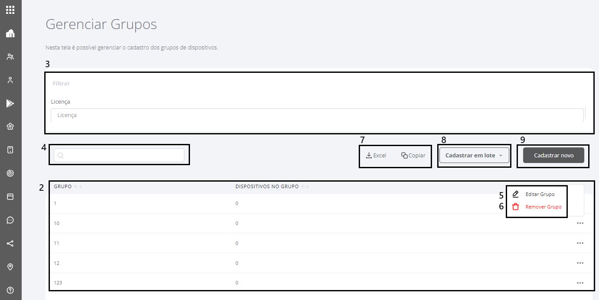

---
layout:
  title:
    visible: true
  description:
    visible: false
  tableOfContents:
    visible: true
  outline:
    visible: true
  pagination:
    visible: true
---

# Gerenciar Grupos

Essa tela do sistema tem como objetivo possibilitar ao usuário administrar os grupos de usuários de dispositivos.

Para administrar um grupo, siga os passos descritos abaixo:

1. A tela de administração de grupos pode ser acessada clicando no menu “**Grupos**” e selecionando o submenu **“Gerenciar Grupos”.** Esta tela também é exibida ao concluir o cadastro de um novo grupo. Esta tela é apresentada na sequência do texto.

<figure><figcaption></figcaption></figure>

2. Ao entrar na tela, a lista de grupos cadastrados é exibida.

<figure><figcaption></figcaption></figure>

3. É possível utilizar o filtro de Licença para encontrar o grupo de um usuário.
4. No campo de pesquisa você pode buscar por um grupo específico.
5. Para editar um grupo clique nos três pontinhos que aparecem à direita na linha do grupo. Escolha a opção "**Editar Grupo**". Na edição é possível incluir ou excluir usuários do grupo.
6. Para excluir um grupo clique nos três pontinhos que aparecem à direita na linha do grupo. Escolha a opção "**Remover Grupo**".
7. Caso queira, também é possível copiar os dados exibidos sobre os grupos para a área de transferência ou gerar uma planilha Excel com os dados.
8. Para realizar a criação de grupos em lotes, o que agiliza a criação de grandes quantidades de grupos, baixe o modelo em Excel que contem duas colunas Grupo e Dispositivo, preencha com as informações pertinentes, salve e faça a importação para o portal (o arquivo deve ter o limite máximo de 5 MB).

O sistema fará a validação do arquivo, na importação e exibirá a seguinte mensagem caso o arquivo não possua as informações do modelo: _”As informações do arquivo modelo são inválidas, revise o arquivo e tente novamente!"._ Selecione o botão "**Cadastrar Novo**" para iniciar o cadastro de um novo grupo. Se o arquivo possuir as informações válidas, aparecerá uma mensagem informando que a importação será processada em background: _“Por favor aguarde a importação das informações! O sistema exibirá uma notificação na parte superior da tela ao concluir, onde poderá revisar o resultado da importação."_&#x20;

O sistema validará se os grupos informados existem na empresa, independente se está escrito em letras minúsculas ou maiúscula e irá criar os grupos informados, caso não existam na empresa, mesmo que não possuam dispositivos vinculados, vinculará o dispositivo ao grupo informado, caso: o dispositivo exista e o dispositivo não esteja vinculado a outro grupo.

Se caso o dispositivo esteja cadastrado em outro grupo, não importará apenas esse dispositivo

Quando o processamento for concluído, aparecerá uma notificação com a opção  “Ver detalhes", ao clicar irá abrir uma lista de erros para conferência.

9. Selecione o botão "Cadastrar Novo" para iniciar o cadastro de um novo grupo.

Ao concluir as alterações no grupo, o sistema retornará para a tela de administração de grupos.
